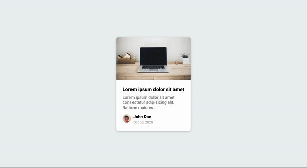

# 50 Projects in 50 Days - Content Placeholder 

This is a code along project in the [50 Projects In 50 Days - HTML, CSS & JavaScript Udemy Course](https://www.udemy.com/course/50-projects-50-days/). Sharpen your skills by building 50 quick, unique & fun mini projects.

## Table of contents 😌

- [Overview](#overview)
  - [The project](#the-project)
  - [Screenshot](#screenshot)
  - [Links](#links)
- [My process](#my-process)
  - [Built with](#built-with)
  - [What I learned](#what-i-learned)
  - [Continued development](#continued-development)
  - [Code snippets](#im-really-proud-of-these-code-snippets%EF%B8%8F)
  - [Useful resources](#useful-resources)
- [Author](#author)
- [Acknowledgments](#acknowledgments)

## Overview👋🏾

Welcome to the 24<sup>th</sup> mini-project of the course!

### The project😥

In this project users will be able to:

- Build a content placeholder that displays a loading animation before the content appears.

### Screenshot🌇



### Links👩🏾‍💻

- Live Site URL: (https://fantastic-bienenstitch-d04af5.netlify.app/)

## My process💭

This is a simple project that I started by building out the card with HTML and CSS. Next I finalized the UI by creating this animation with CSS using modifying the background position of a linear gradient.  I then added functionality by way of JavaScript by inserting the content via JavaScript.


### Built with👷🏾‍♀️

- Semantic HTML5 markup
- CSS custom properties
- Flexbox
- JavaScript

### What I learned👩🏾‍🏫

I learned that a commonly used entity in HTML is the non-breaking space: &nbsp; A non-breaking space is a space that will not break into a new line.

### Continued development🔮

The content is hardcoded in the JS but in the future this could be fetched from an API

### I'm really proud of these code snippets✂️

```css
.animated-bg {
  background-image: linear-gradient(
    to right,
    #f6f7f8 0%,
    #edeef1 10%,
    #f6f7f8 20%,
    #f6f7f8 100%
  );
  background-size: 200% 100%;
  animation: bgPos 1s linear infinite;
}

/* changes the position on the x-axis */
@keyframes bgPos {
  0% {
    background-position: 50% 0;
  }
  100% {
    background-position: -150% 0;
  }
}
```

```js
// run getData function after 2.5 secs
setTimeout(getData, 2500)

function getData() {
    header.innerHTML = ''
    title.innerHTML = 'Lorem ipsum dolor sit amet'
    excerpt.innerHTML = 'Lorem ipsum dolor sit amet consectetur adipisicing elit. Ratione maiores.'
    profile_img.innerHTML = ''
    name.innerHTML = 'John Doe'
    date.innerHTML = 'Oct 08, 2020'

    animated_bgs.forEach(bg => bg.classList.remove('animated-bg'))
    animated_bg_text.forEach(bg => bg.classList.remove('animated-bg-text'))
}
```

### Useful resources📖

- [Resource](https://www.w3schools.com/html/html_entities.asp#:~:text=A%20commonly%20used%20entity%20in,the%20words%20might%20be%20disruptive.) - This is an amazing article which helped me write better commit messages. I'd recommend it to anyone still learning this concept.

## Author🔎

- Website - [Portfolio Site](https://maiannethornton.netlify.app/)
- Frontend Mentor - [@MaianneThornton](https://www.frontendmentor.io/profile/MaianneThornton)
- GitHub - [@MaianneThornton](GitHub.com/MaianneThornton)
- Twitter - [@MaianneThornton](https://twitter.com/MaianneThornton)
- LinkedIn - [@MaianneThornton](https://www.linkedin.com/in/maiannethornton/)

## Acknowledgments🙏🏾

Special Thanks go to [Brad Traversy](http://www.traversymedia.com/) and [Florin Pop](http://www.florin-pop.com/) creating the course and making reviewing concepts fun 😊.
